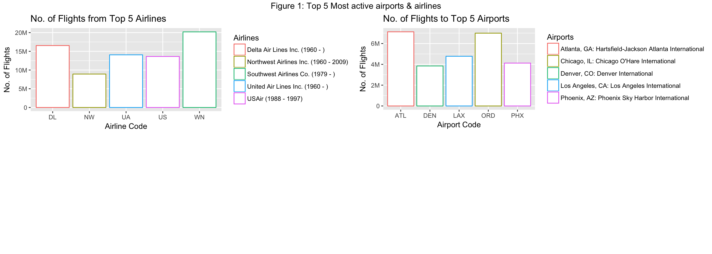
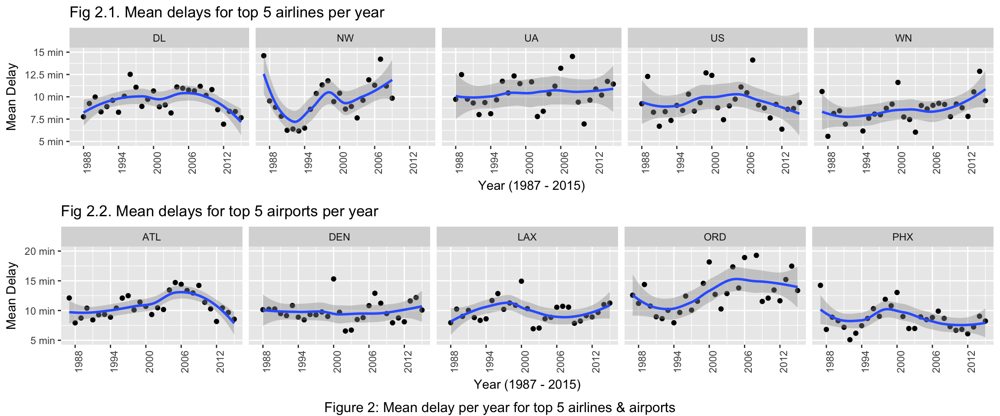
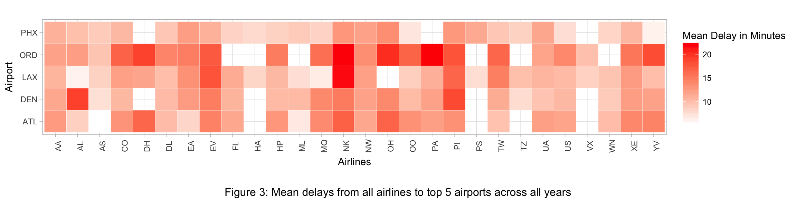
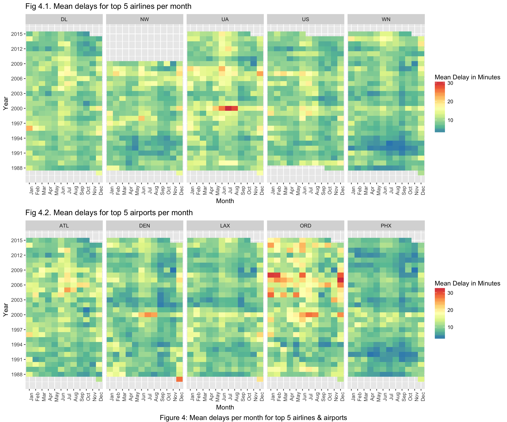

# Visualizing Flight Delays

## Top 5 Airports and Airlines based on activity



## Mean Delay Per Year



## Mean Delay across all years for top 5 airports



## Mean Delay Per Month



### Requirements

Install `Java 1.8`

Download `Hadoop 2.8.1`

**R Requirements**

Install following dependencies to avoid errors while generating the Rmarkdown Report.

From your R console execute following commands:

```
install.packages("ggplot2")
install.packages("RColorBrewer")
install.packages("gridExtra")
```

### How to run the project end to end:

* Change the Hadoop Home path in the Makefile to the Hadoop Home path on your system
* Make sure you put all the input files inside the `input` folder and run `make setup`
* Open terminal in the root directory of the project and execute command `make run`
